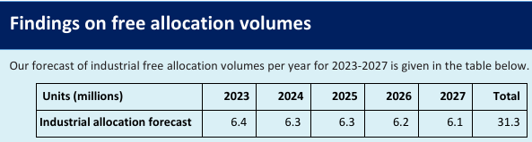
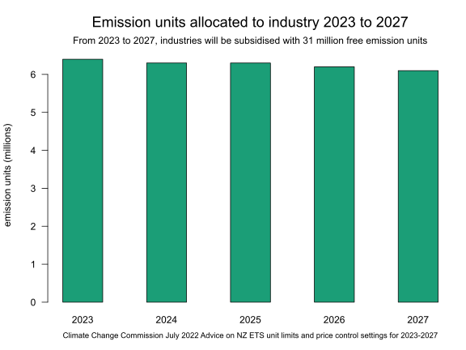
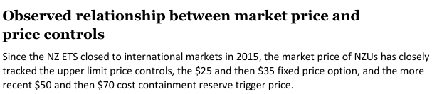
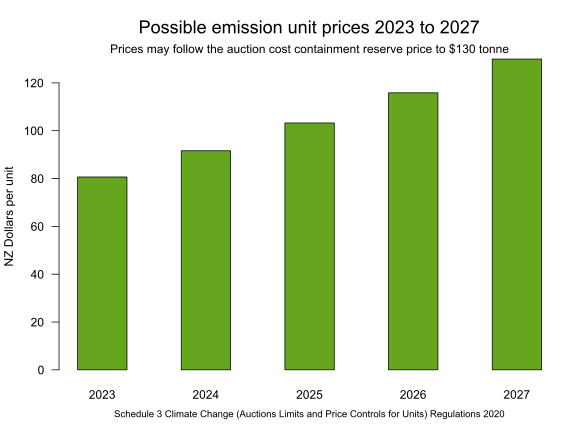
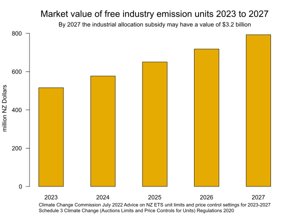

# End the dirty polluters subsidy of industry allocation and give the emission units to Cyclone Gabrielle recovery  

## End the subsidy of 'industry allocation' the subsidized free emission units given to emissions intensive industry

Every year since 2010, emissions intensive emitters have received a subsidy of millions of free emissions units under the emissions trading scheme [industrial allocation](https://www.epa.govt.nz/industry-areas/emissions-trading-scheme/industrial-allocations/decisions/) rules.

Is it still morally conscionable for the emissions trading scheme to keep giving emitters millions of dollars worth of free emissions units, when the costs of recovery from the climate tragedy Cyclone Gabrielle are going to be billions of dollars?

I penned this message to Prime Minister Chris Hipkins, Finance Minister Grant Robertson and Minister for Climate Change James Shaw.

Tena koe Prime Minister Hipkins,

The Dominion Post has reporting that the Minister of Finance the Hon Grant Robertson has said that <a href="https://www.stuff.co.nz/business/opinion-analysis/131288785/tom-pullarstrecker-cyclone-leaves-less-room-to-deal-with-more-shocks">billions of dollars</a> will be needed for the recovery from Cyclone Gabrielle. I don't think anyone reasonable is disagreeing with him about the scale of the challenge helping impacted communities.

I have a suggestion to help provide funds for Cyclone Gabrielle without either raising new taxes or new borrowing or by reducing funding of important existing programs.  

The Ministry for the Environment and the Climate Change Commission both expect that in calendar year 2023, 6.4 million emissions units will be allocated at no cost to industries.

At [Tuesday's spot price of $67.50](https://www.carbonnews.co.nz/story.asp?storyID=27088), these units would be valued at $432 million. My suggestion is to quickly amend the Climate Change Response Act 2002 (or it's related regulations) and add the industrial allocation units to the quarterly auctions of emission units and commit the proceeds to recovery from Cyclone Gabrielle.

You will need to get officials to act promptly as emitters will be applying for units from January to April 2023.

As the amount of forecast allocation units is over 6 million units through to 2027, there is an ongoing stream of about 400 to 500 million dollars (depending on unit prices) available for another 5 years.

What could be a better source of funding for recovery from a climate crisis event than diverting funding from emitter industries?"

Nga mihi.

Some background. The Climate Change Commission's estimate of the free emission units allocated is from page 38 of their report [Advice on NZ ETS unit limits and price control settings for 2023-2027](https://www.climatecommission.govt.nz/our-work/advice-to-government-topic/nz-ets/our-advice-on-the-nz-ets/nz-ets-unit-limits-and-price-control-settings-for-2023-2027/).

Let's make a bar plot of the free emission units given to emitters under the Industrial Allocation policy.

The Ministry for the Environment says that the spot market NZU price has followed the cost containment reserve trigger price [page 25 of the consultation document](https://environment.govt.nz/publications/proposed-changes-to-new-zealand-emissions-trading-scheme-limit-and-price-control-settings-for-units-2022-consultation-document/) "Proposed changes to New Zealand Emissions Trading Scheme limit and price control settings for units 2022".
* <i>"Since the NZ ETS closed to international markets in 2015, the market price of NZUs has closely tracked the upper limit price controls, the $25 and then $35 fixed price option, and the more recent $50 and then $70 cost containment reserve trigger price."</i>

What is the cost containment reserve trigger price? The Climate Change Commission says: 
* <i>"The cost containment reserve (CCR) is a reserve of NZUs available for sale if the auction clearing price is at or above a specified trigger price".</i>

The cost containment reserve trigger price is set in [Schedule 3](https://legislation.govt.nz/regulation/public/2020/0264/latest/LMS376569.html) of the Climate Change (Auctions, Limits, and Price Controls for Units) Regulations 2020.

The reserve trigger prices are also listed on the Ministry for the Environment's website at [Price control settings](https://environment.govt.nz/what-government-is-doing/areas-of-work/climate-change/ets/nz-ets-market/emission-unit-prices-and-controls/).

Clearly we need a bar plot of the cost containment reserve trigger prices out to 2027.

Assuming that from now until 2027 the spot price for NZUs follows the cost containment reserve trigger price as it did in 2022, then the market values of the 'industrial allocation' free emission units are the volumes (about 6 million units per annum) multiplied by the trigger prices.

Which results in about half a billion $NZD per year for recovery from Cyclone Gabrielle from 2023 to 2027

2023  $516,096,000

2024  $577,143,000

2025  $650,412,000

2026  $718,208,000

2027  $792,817,000

By 2027 this will add up to a total fund of over $3 billion $NZD ($3,254,676,000). We need to make another bar plot.

While I have received automated email replies to my emails to Hipkins, Robertson and Shaw, I have not received a substantative reply.

It just seems a no brainer to me that it is morally unconscionable to have an emissions trading scheme that subsidizes emissions intensive industry with $3 billion worth of free emissions units when those funds could be put into recovery from Cyclone Gabrielle.
